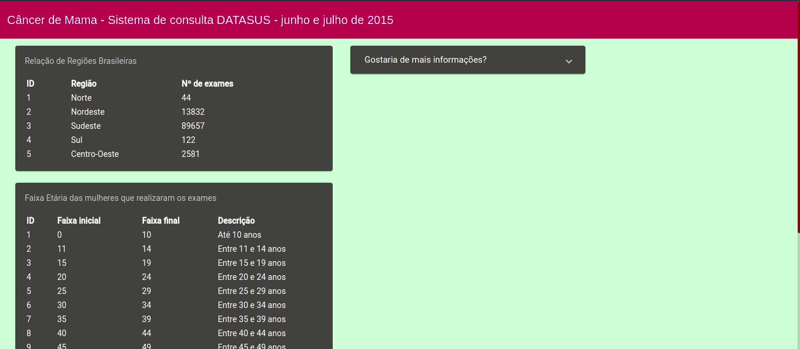

<h1 align="center">
  Philips Dev Week
</h1>

<p align="center">🎗️ Aplicação de consulta ao DataSUS desenvolvida durante o evento Philips Dev Week da DIO 🎗️ Em construção 🚧</p>

<p align="center">
• <a href="#-sobre-o-projeto">Sobre</a> •
 <a href="#%EF%B8%8F-funcionalidades">Features</a> • 
 <a href="#-demonstra%C3%A7%C3%A3o">Demonstração</a> • 
 <a href="#-como-executar-o-projeto">Como executar</a> • 
 <a href="#-tecnologias">Tecnologias</a> •
 <a href="#%EF%B8%8F-autora">Autora</a> •
</p>

## 💻 Sobre o projeto

O evento contou com 4 dias de aulas exclusivas para construir um Sistema de Consulta para Tratamento de Câncer de Mama do SUS. Utilizamos tecnologias como Angular, Springboot, MySQL e Java.

## ⚙️ Funcionalidades

<details>
  <summary>Aula 1</summary>
Na primeira aula realizamos todas as configurações necessárias para iniciar o projeto. Além de instalar as dependências e acessar a base de dados do SUS, baixar e limpar os dados para popular o banco de forma mais assertiva. 
</details>

<details>
  <summary>Aula 2</summary>
Aqui, começamos a desenvolver o Back-end com Java e Springboot, acessando os dados sobre câncer de mama no DATASUS. Criamos um projeto em Springboot utilizando JPA para persistência dos dados e desenvolvimento do Back-end, fazendo testes acessando os dados.
</details>

<details>
  <summary>Aula 3</summary>
Nesta aula, desenvolvemos o Front-end, criando uma interface web com Angular. 
</details>

<details>
  <summary>Aula 4</summary>
Na quarta e última aula, integramos o Back-end com o Front-end e testes com a API.
</details>

## 🎨 Demonstração

O deploy da aplicação pode ser acessado na <a href="https://philips-dev-week.vercel.app/exames">Vercel</a>.

<p align="center">
  
</p>

## 🚀 Como executar o projeto

Este projeto é divido em duas partes:
1. Backend (pasta /devweek) 
2. Frontend (pasta /src)

### Pré-requisitos

Antes de começar, você vai precisar ter instalado em sua máquina as seguintes ferramentas:
[Git](https://git-scm.com), [Node.js](https://nodejs.org/en/). 

Além disso, é bom ter um editor para trabalhar com o código, como o [IntelliJ](https://www.jetbrains.com/pt-br/idea/download/) ou [VSCode](https://code.visualstudio.com/).

#### 🎲 Rodando a aplicação

``` bash
# Clone o repositório
$ git clone git@github.com:dandara-dias/philips-dev-week.git

# Entre na pasta do repositório que você acabou de clonar
$ cd philips-dev-week

# Instale as dependências
$ npm install

# Inicie a aplicação
$ npm start

# A aplicação iniciará na porta 4200 - acesse http://localhost:4200 
```

## 🛠 Tecnologias

As seguintes ferramentas foram usadas na construção do projeto:

#### **Website** ([Angular](https://angular.io/) + [TypeScript](https://www.typescriptlang.org/))

-   **[Material UI](https://material.angular.io/)**

> Veja o arquivo [package.json](https://github.com/dandara-dias/philips-dev-week/blob/master/package.json)

#### **Server** ([Java](https://www.java.com/pt-BR/))

-   **[Spring Boot](https://start.spring.io/)**
-   **[JPA](https://www.devmedia.com.br/introducao-a-jpa-java-persistence-api/28173)**
-   **[Maven](https://maven.apache.org/)**

> Veja o arquivo [pom.xml](https://github.com/dandara-dias/philips-dev-week/blob/master/devweek/pom.xml)

#### **Utilitários**

-   Editores:  **[Visual Studio Code](https://code.visualstudio.com/)**, **[IntelliJ](https://www.jetbrains.com/pt-br/idea/download/)**
-   Markdown:  **[Rocketseat](https://blog.rocketseat.com.br/como-fazer-um-bom-readme/)**
-   Favicon:  **[Icons8](https://icons8.com.br/icons/set/favicon)**
-   Paleta de cores: **[Coolors](https://coolors.co/)**
-   Fontes:  **[Roboto](https://fonts.google.com/specimen/Roboto)**, **[Varela Round](https://fonts.google.com/specimen/Varela+Round?query=Varela+Round)**

## 🦸‍♀️ Autora

 
 <b>Dandara Dias</b> 🎀
 
[](https://www.linkedin.com/in/dandara-dias/) 
<a href = "mailto:dandaradias.contato@gmail.com"></a>
